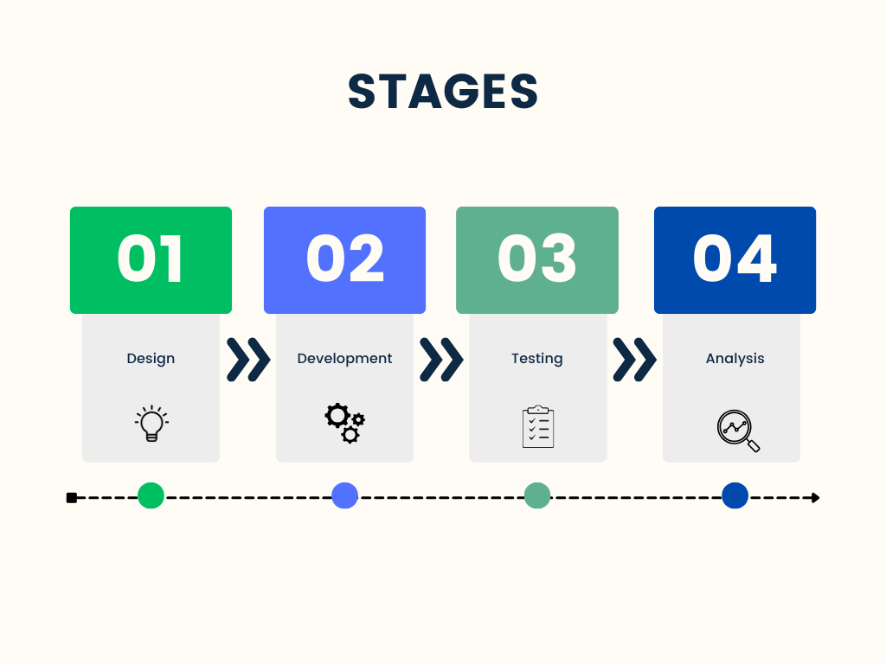
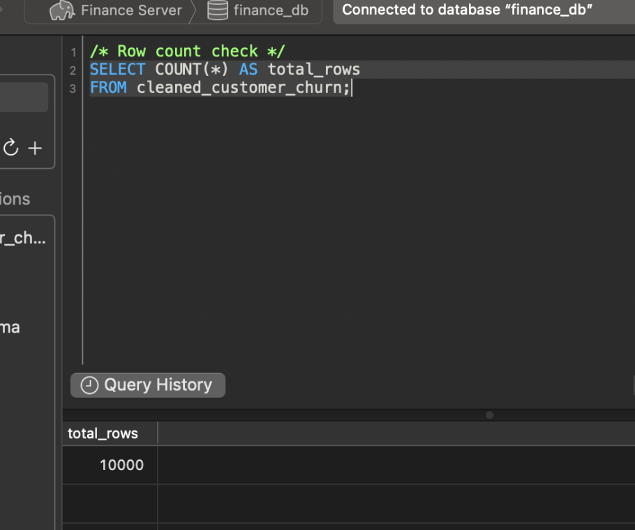
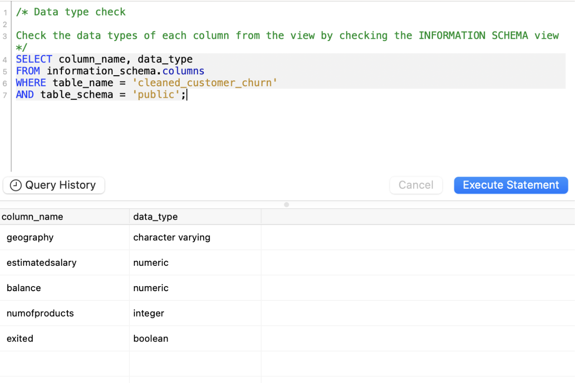
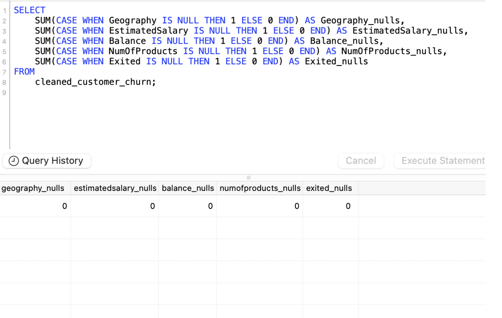

# BronsonJS.github.io

# Objective

- What is the key pain point?

  The Head of Customer Retention at the bank needs to understand the factors that lead to the risk of customer churn. They want to use visual insights to identify trends in customer demographics, behaviour, and satisfaction levels to reduce churn rates and improve customer retention strategies.

- What is the ideal solution?

  The ideal solution is to develop an interactive dashboard that visualises customer churn patterns based on key factors such as Geography, Salary, Balance, and Product Usage. The dashboard should provide:

- Churn Rate Overview: A high-level view of the total churn rate to quickly identify the overall scale of customer attrition.
  
- Breakdown of Churned vs. Retained Customers: Visuals that compare churned and retained customers across segments like geographic regions and financial brackets.
  
- Product Usage Insights: Analysis of how the number of products a customer owns influences churn, helping to understand engagement levels.
  
- Clear, Actionable Visuals: Easy-to-understand graphs and charts that highlight key trends and factors contributing to churn, enabling the retention team to quickly target at-risk segments.

This dashboard will empower the customer retention team to proactively address churn by focusing on segments most at risk, ultimately enhancing customer loyalty and improving retention strategies.

## User Story 

As the Head of Customer Retention, I need a visual dashboard to help me understand and analyse customer churn patterns across the bank's customer base.

The dashboard should enable me to:

- View a comprehensive overview of the churn rate, segmented by key customer attributes like Geography, Salary, and Product Usage.
  
- Identify high-risk customer segments most likely to churn, based on financial behaviours and engagement levels with bank products.
  
- Make informed, data-driven decisions to develop targeted retention strategies that focus on retaining customers most at risk of leaving.

# Data Source 

- What data is needed to address the objective?

To effectively address the objective and create meaningful visual insights for customer churn, the dataset should include the following key data points:

- Geography
- Financial Information
- Product Usage
- Churn Status

- The data is sourced from a CSV file on Kaggle. [See here to find it](https://www.kaggle.com/datasets/radheshyamkollipara/bank-customer-churn).

# Stages



# Design 

## Dashboard Components Required

- What should the dashboard contain based on the requirements provided?

**1. Churn Rate**  
*Purpose*: Provides a high-level overview of the overall churn rate.  
*Why*: This KPI gives the retention team a quick understanding of how many customers are leaving.

**2. Churn by Country**  
*Purpose*: Compares churn rates across countries.  
*Why*: A bar chart is effective for comparing churn across the three primary countries in the dataset: France, Spain, and Germany.

**3. Churn by Salary**  
*Purpose*: Displays churn distribution across salary brackets.  
*Why*: Customers with different income levels may show varying churn risks, helping target retention efforts by salary range.

**4. Balance vs. Churn**  
*Purpose*: Visualizes how customer account balances influence churn.  
*Why*: Provides insight into whether customers with lower balances are more likely to churn.

**5. Churn by Number of Products**  
*Purpose*: Shows how the number of products a customer holds affects churn rates.  
*Why*: Understanding the relationship between product engagement and churn allows the bank to incentivize customers to use more products.

## Tools

| Tool        | Purpose                                              |
|-------------|------------------------------------------------------|
| Excel       | Exploring the data                                   |
| SQL Server  | Cleaning, Testing, and Analyzing the data            |
| Power BI    | Visualizing the data with interactive dashboards     |
| GitHub      | Hosting the project documentation and version control |

# Development 

- Whats the general approach in creating this solution from start to finish?

 1.	Get the data
 2.	Explore the data in Excel
 3.	Load the data into SQL Server
 4.	Clean the data with SQL
 5.	Test the data with SQL
 6.	Visualize the data in Power BI
 7.	Generate the findings based on the insights
 8.	Report the documentation 
 9.	Publish the data to GitHub Pages

## Data Exploration Notes

- What are your initial observations with this dataset? What’s caught your attention so far?

  1. The dataset includes a variety of columns, including demographic, financial, and behavioural data. This signals that we have a comprehensive dataset to address the churn analysis without needing additional data.
  2. The column names are clear and self-explanatory, with no need for renaming or reformatting, except for minor formatting
  3. The data types seem appropriate, with numerical values where expected and categorical values clearly defined
  4. Some customers have a balance of 0, which could either represent actual zero balances or missing/incorrect data for those accounts. This needs further investigation to determine if these zeros affect churn rates significantly.

## Should we include customers with null or zero balences 

- If Zero Balance Indicates Active Usage: If these customers are still using the bank for other products (e.g., credit cards, loans, or other services), then they should be included in the analysis. Their balance being zero doesn’t necessarily mean they are unengaged.

## Data Cleaning

### Creating a Refined Table with Essential Columns for Churn Analysis

The aim is to refine our dataset to ensure it is structured and ready for analysis.

 - Only relevant columns should be retained.
 - All data types should be appropriate for the contents of each column.

```sql
CREATE TABLE cleaned_customer_churn AS
SELECT 
    Geography,
    EstimatedSalary,
    Balance,
    NumOfProducts,
    Exited
FROM 
    customer_churn;

```

# Testing

- What type of quality and validation checks are you going to create?

## 1. Row Count Check

### SQL Query
   
``` sql
/* Row count check */
SELECT COUNT (*) AS total_rows
FROM cleaned_customer_churn
```
### Output 



## 2. Column Count Check 
### SQL Query
``` sql
/* Column count check */
SELECT COUNT(*) AS total_columns
FROM information_schema.columns
WHERE table_name = 'cleaned_customer_churn';
```

### Output 


## 3. Data Type Check 
### SQL Query

``` sql
/* Data type check

Check the data types of each column from the view by checking the INFORMATION SCHEMA view
*/
SELECT column_name, data_type
FROM information_schema.columns
WHERE table_name = 'cleaned_customer_churn'
AND table_schema = 'public';
```
### Output 


## 4. Null and missing value checks 
### SQL Query

- All counts should be zero:

``` sql
SELECT 
    SUM(CASE WHEN Geography IS NULL THEN 1 ELSE 0 END) AS Geography_nulls,
    SUM(CASE WHEN EstimatedSalary IS NULL THEN 1 ELSE 0 END) AS EstimatedSalary_nulls,
    SUM(CASE WHEN Balance IS NULL THEN 1 ELSE 0 END) AS Balance_nulls,
    SUM(CASE WHEN NumOfProducts IS NULL THEN 1 ELSE 0 END) AS NumOfProducts_nulls,
    SUM(CASE WHEN Exited IS NULL THEN 1 ELSE 0 END) AS Exited_nulls
FROM 
    cleaned_customer_churn;
```

### Output 
 

# Visualisation 
## Results 
 - What does the dashboard look like?

(input Power BI Dashboard) 

## Dax Measures 
### 1. Churn Rate (%) 
``` sql
Churn Rate (%) = 
DIVIDE(
    COUNTROWS(
        FILTER(
            'cleaned_customer_churn',
            'cleaned_customer_churn'[Exited] = TRUE
        )
    ),
    COUNTROWS('cleaned_customer_churn'),
    0
) * 100
```

### 2. Churn Rate by Country (%)
``` sql
Churn Rate by Country (%) = 
VAR ChurnedCustomers =
    CALCULATE(
        COUNTROWS('cleaned_customer_churn'),
        'cleaned_customer_churn'[Exited] = TRUE
    )
VAR TotalCustomers =
    COUNTROWS('cleaned_customer_churn')
RETURN
DIVIDE(ChurnedCustomers, TotalCustomers, 0) * 100

```
### 3. Churn Rate by Number of Products 
``` sql
Churn Rate by Number of Products (%) = 
DIVIDE(
    CALCULATE(
        COUNTROWS('cleaned_customer_churn'),
        'cleaned_customer_churn'[Exited] = TRUE()
    ),
    COUNTROWS('cleaned_customer_churn'),
    0
)

```
### 4. Churned Customers 
``` sql
Churned Customers = 
CALCULATE(
    COUNTROWS('cleaned_customer_churn'),
    'cleaned_customer_churn'[Exited] = TRUE()
)
```

### 5. Retained Customers 
``` sql
Retained Customers = 
CALCULATE(
    COUNTROWS('cleaned_customer_churn'),
    'cleaned_customer_churn'[Exited] = FALSE()
)

```

### 6. Salary Bracket
``` sql
Salary Bracket = 
SWITCH(
    TRUE(),
    'cleaned_customer_churn'[EstimatedSalary] < 51000, "< $51k",
    'cleaned_customer_churn'[EstimatedSalary] >= 51000 && 'cleaned_customer_churn'[EstimatedSalary] < 100000, "$51k - $100k",
    'cleaned_customer_churn'[EstimatedSalary] >= 100000 && 'cleaned_customer_churn'[EstimatedSalary] < 149000, "$100k - $149k",
    'cleaned_customer_churn'[EstimatedSalary] >= 149000, "> $149k",
    "Unknown"
)
```

# Analysis 

- What did we find?

For this analysis, we’re going to focus on the questions below to get the information we need for our Retention Team 

Here are the key questions we need to answer for our marketing client:

1. What is the overall churn rate at the bank?
2. Which geographic regions have the highest churn rates?
3. How does salary influence customer churn?
4. What is the relationship between account balance and churn?
5. How does the number of products held by a customer affect their likelihood to churn?
6. What potential revenue loss is associated with churn in high-risk segments?
7. What strategies can be implemented to reduce churn among high-risk customer groups?

## 1. Overall Churn Rate 


## 2. 

To address the churn rates across different countries, we analyze data for Germany, Spain, and France. By designing a targeted retention incentive program, the aim is to decrease churn by offering a $50 account credit or equivalent service upgrade to at-risk customers in each country.

Campaign Idea: Targeted Retention Incentive Program  
 
 - Objective = Reduce customer churn by offering incentives to retain at-risk customers in each country.
 - Incentive Offered = $50 account credit or equivalent service upgrade.
 - Conversion Rate = Estimated 10% of targeted customers will accept the offer and stay with the bank.
 - Campaign Cost per Customer = $50
 - Average Annual Revenue per Customer = $1,000

1. Germany

- Conversion Rate = 10%
- Potential Customers Retained = 81 customers  `814 churned customers * 10%`
- Potential Revenue Retained = $81,000  `81 customers * $1,000 (average annual revenue per customer)`
- Campaign Cost = $4,050  `81 customers * $50 (incentive per customer)`
- Net Profit = $76,950  `$81,000 (revenue retained) - $4,050 (campaign cost)`
- ROI = 1,900%   `($76,950 / $4,050) * 100`

2. Spain
- Conversion Rate = 10%
- Potential Customers Retained = 41 customers  `413 churned customers * 10%`
- Potential Revenue Retained = $41,000  `41 customers * $1,000`
- Campaign Cost = $2,050  `41 customers * $50`
- Net Profit = $38,950  `$41,000 - $2,050`
- ROI = 1,900%  `($38,950 / $2,050) * 100`


